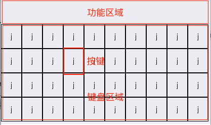

###键盘设计



* 上面的区域为动态显示区域，目前用来显示功能键，后期可以用来显示候选字母键。
* 按键可以改变背景颜色，字体颜色，字体大小，可以设置title和对应的要输入的内容
* 键盘按键可以横着合并，合并后，显示的title居中显示，按键的配置信息根据第一个按键的信息显示。

保存键盘数据的结构体：

```
[{name:'shell keyboard',desc:'this is keyborad, this is a keyboard',keysinfo:[{bgcolor:'',titledesc:'',titlecolor:'',titleSize:'',isshow:'',isCombine:''}]}]

```

点击按钮，进入按钮设置界面，对应的